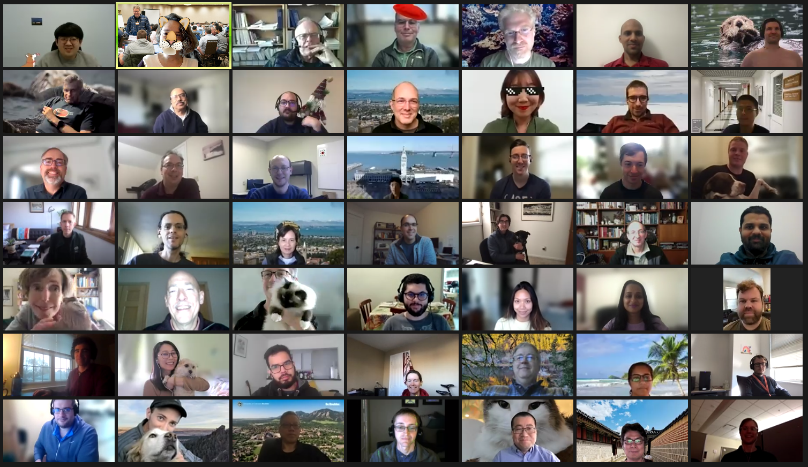
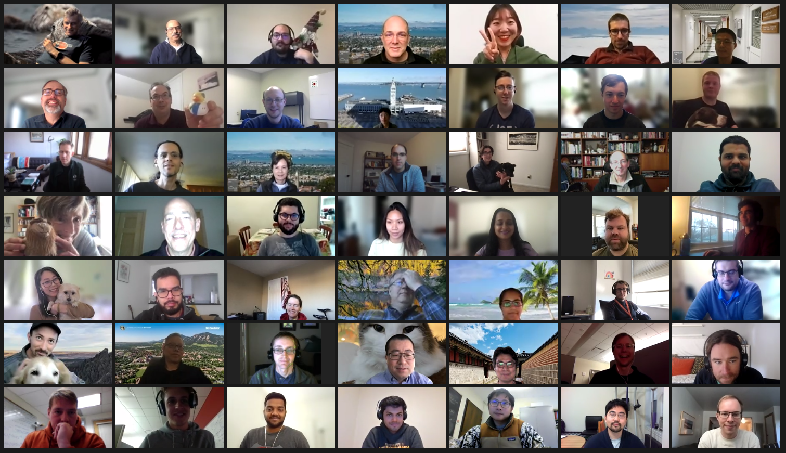

.. GPU Acceleration documentation master file, created by
   sphinx-quickstart on Fri Oct 30 17:26:59 2020.
   You can adapt this file completely to your liking, but it should at least
   contain the root `toctree` directive.

GPU acceleration
================

This documents our attempt accelerate DART subroutines during the `NERSC GPU
Hackathon <https://www.gpuhackathons.org/event/nersc-december-gpu-hackathon-2021>`_.

Introduction slides for team-dart
=================================

We delivered a `PowerPoint presentation <./_static/team_dart_intro.pptx>`__ to 
teach the participants and mentors what DART does.

Group photos
============

|group_photo_1|

|group_photo_2|

.. toctree::
   :maxdepth: 2
   :hidden:
   :caption: Machines
   
   /machines/casper
   /machines/ascent
   /machines/perlmutter

.. toctree::
   :maxdepth: 2
   :hidden:
   :caption: DART

   /dart/compiling

.. toctree::
   :maxdepth: 2
   :hidden:
   :caption: Notes

   /notes/zero-to-gpu-hero
   /notes/nsight
   /notes/nvtx
